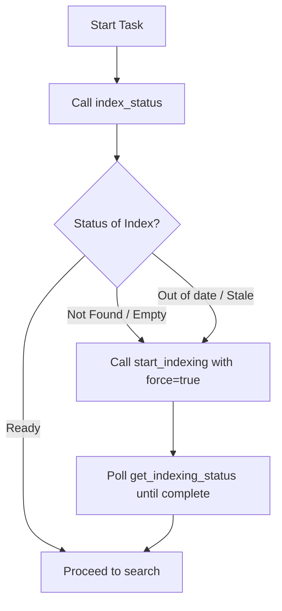

# Skill: Local Memory Expert

A guide for managing and utilizing the local vector search and indexing system via Model Context Protocol (MCP). This system consists of two companion servers:
1. **`local-memory-indexer`** (Write-only): Discovers files, splits them into semantic/AST chunks, enriches them using an LLM, and generates vector embeddings.
2. **`local-memory-search`** (Read-only): Queries the vector database and metadata to provide semantic, keyword, and hybrid search capabilities.

---

## 🎯 Strategic Intent
Enable any AI Agent (including smaller models like 20B parameters) to autonomously maintain a project's index, execute precise search queries, and diagnose or repair index corruption without causing performance issues or resource starvation.

---

## 📋 Tool Reference & Workflows

### 1. Index Management (`local-memory-indexer`)
- **`start_indexing`**: Initiates background indexing.
  - *Parameters:* `project_path` (required), `phases` (defaults to `["discovery","embedding"]`), `force` (re-index all files, default `false`), `batch_size` (defaults to `20`), `enrich` (use LLM to generate summary/tags, default `true`), `backend` (defaults to `"auto"`).
  - *Usage:* Call this to index a project from scratch or refresh changed files.
- **`get_indexing_status`**: Polls active indexing run progress.
  - *Parameters:* `project_path` (required), `run_id` (optional).
  - *Usage:* Always poll this to check `chunks_pending`, `percent_complete`, `throughput_chunks_per_sec`, and look for `warnings[]` or `error`.
- **`pause_indexing`**: Gracefully pauses the active embedding phase.
  - *Parameters:* `run_id` (required).
  - *Usage:* Call this to pause embedding when the system needs to conserve VRAM or CPU.
- **`resume_indexing`**: Resumes a previously paused embedding phase.
  - *Parameters:* `run_id` (required), `project_path` (optional).
- **`delete_project_index`**: Completely deletes all index data (SQLite and LanceDB databases) for a project.
  - *Parameters:* `project_path` (required).
  - *Usage:* Call this before starting a fresh run if you change the embedding model (e.g. from 8B to 4B) to avoid vector dimension mismatches.

### 2. Retrieval & Diagnostics (`local-memory-search`)
- **`health_check`**: Probes readiness of LanceDB, SQLite, and Ollama/Transformers backends.
  - *Parameters:* `project_path` (required).
- **`index_status`**: Summarizes the index state.
  - *Parameters:* `project_path` (required).
  - *Usage:* Reports how many files are indexed, how many chunks are pending, and what capabilities (semantic, keyword, hybrid) are currently active.
- **`search_hybrid`**: Executes a fused search combining vector similarity and keyword FTS.
  - *Parameters:* `project_path`, `query`, `limit` (default `10`), `alpha` (vector vs keyword weight: `0.0` is pure keyword, `1.0` is pure semantic, default `0.65`).
  - *Usage:* The most reliable tool for general code queries.
- **`search_semantic`**: Pure vector search.
  - *Parameters:* `project_path`, `query`, `limit`.
- **`search_keyword`**: Pure keyword/FTS search.
  - *Parameters:* `project_path`, `query`, `limit`.
  - *Usage:* Use when looking for exact variable/function names or exact match patterns.
- **`retrieve_context_pack`**: Retrieves a token-budgeted set of code excerpts matching a query.
  - *Parameters:* `project_path`, `query`, `limit`, `max_chars` (default `12000`), `include_neighbors` (expand context around hits, default `true`), `rerank` (re-rank results using an LLM, default `true`).
  - *Usage:* Use this to fetch high-density context blocks to answer complex "how does X work" questions.
- **`read_chunk_neighbors`**: Fetches adjacent lines of code around a specific chunk.
  - *Parameters:* `project_path`, `chunk_id`, `before` (default `1`), `after` (default `1`).
  - *Usage:* Expand code context around a search hit.
- **`search_similar`**: Finds code segments similar to a given file, class, or function.
  - *Parameters:* `project_path`, `file_path`, `symbol` (optional), `start_line` (optional).
- **`doctor_index`**: Diagnoses schema, lock, or consistency issues.
  - *Parameters:* `project_path` (required).

---

## 🛠️ Step-by-Step Decision Trees

### Scenario A: Working with a new or modified codebase

### Scenario B: Formulating the Search Strategy
* **"Where is X defined / declared?"**
  - **Tool:** `search_keyword` or `search_hybrid(alpha=0.2)`
  - **Reason:** Variable names, struct names, and specific identifiers are best found using exact keyword matching.
* **"How does the authentication module communicate with the database?"**
  - **Tool:** `retrieve_context_pack(rerank=true)` or `search_hybrid(alpha=0.65)`
  - **Reason:** Concept-based queries require semantic understanding, and context packs gather all relevant pieces with summaries in a compressed format.
* **"I found function Y, I want to see what is written right above/below it."**
  - **Tool:** `read_chunk_neighbors` using the `chunk_id` of function Y.
  - **Reason:** This allows you to reconstruct contiguous file blocks without reading the entire file from disk.
* **"Find other places in the codebase implementing a similar pattern to file Z."**
  - **Tool:** `search_similar(file_path=Z)`
  - **Reason:** Leverages existing vector representations to find parallel structures.

---

## ⚠️ Troubleshooting & Self-Healing

### 1. Error: `SCHEMA_MISMATCH` or vector dimension errors
* **Cause:** The project was previously indexed with a model using different dimensions (e.g. `8b` with 4096 dimensions) and you switched to a different model (e.g. `4b` with 1024 or 2560 dimensions).
* **Action:**
  1. Call `delete_project_index(project_path)`.
  2. Call `start_indexing(project_path, force=true)`.

### 2. Error: `query_vectorization_failed` (Embedding backend offline)
* **Cause:** Ollama is taking too long to load the model into memory (GPU model swap latency > query timeout).
* **Action:**
  1. Check `health_check(project_path)` to verify which backend is online.
  2. If Ollama is used, warm up the model manually or retry the query; once loaded, subsequent queries will run instantly.
  3. If Ollama remains unreachable, the search engine will automatically degrade to keyword-only search (`mode: "keyword_only"`).

### 3. Warning: `EMBEDDING_IN_PROGRESS` (Partial Index)
* **Cause:** Indexer is currently running Phase 2 in the background.
* **Action:** Search queries are safe to run, but keep in mind they will search only the portion of chunks that have already been embedded. Use `get_indexing_status` to monitor progress.

---

## 💡 Pro-Tips for AI Agents
- **Metadata Leverage:** When parsing search results, always inspect the `summary` and `tags` fields. They contain LLM-generated insights that clarify *why* the code was written.
- **VRAM Control:** If your host machine has limited resources (e.g., a 4 GB GPU), ensure the indexer is configured with `batch_size: 20` and the default models are set to lightweight options like `qwen3-embedding:4b` and `granite4.1:3b` in the [constants.ts](file:///home/sr/Projects/Workspace/agent-forge/servers/local-memory-indexer/src/constants.ts) configuration file.
